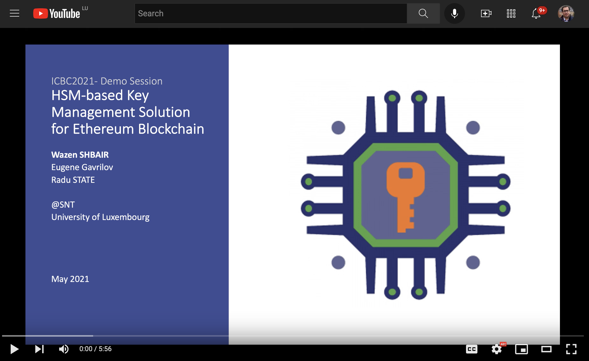

# HSM-based Ethereum Key Management Solution
Use HSM to generate and sign Ethereum transaction

### Built With

* [SoftHSM](https://github.com/opendnssec/SoftHSMv2)
* [Graphene](https://github.com/PeculiarVentures/graphene)
* [Express - Node.js web application framework](https://expressjs.com)
* [Semantic UI](https://semantic-ui.com/)

<!-- GETTING STARTED -->
## Getting Started

### Prerequisites
* Install the SoftHSM from [https://www.opendnssec.org/softhsm/](https://www.opendnssec.org/softhsm/)
* Local or remote Ethereum Geth instance [https://geth.ethereum.org/](Geth)
  
### Installation

2. Clone the repo
   ```sh
   git clone https://github.com/wshbair/HSM2ETH.git
   ```
3. Install NPM packages
   ```sh
   npm install
   ```
4. Set the Web3 provider in `index.js`
   ```js
   const web3 = new Web3(new Web3.providers.HttpProvider("YOUR GETH Instance"));

   ```
   
5. In console panel run 
   ```sh
   npm start
   ```

6. In the browser open http://localhost:8090

## Demo
[](https://www.youtube.com/watch?v=R0_-ZKoEGn8)
 
## Credit 
Based on the steps given in [ethereum stackexchange question](https://ethereum.stackexchange.com/questions/73192/using-aws-cloudhsm-to-sign-transactions) about using HSM to sign ethereum transactions.

## Citation 
````
@inproceedings{shbair2021hsm,
  title={HSM-based Key Management Solution for Ethereum Blockchain},
  author={Shbair, Wazen and Gavrilov, Eugene and others},
  booktitle={IEEE International Conference on Blockchain and Cryptocurrency, 3-6 May 2021},
  year={2021}
}
````
